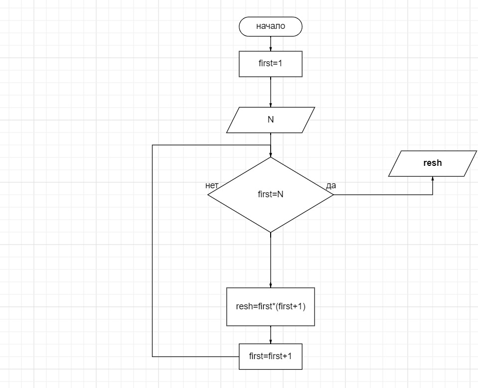

# Инструкция для работы MarkDown

## Выделение текста

=======
## Выделение текста
Чтобы выделить текст курсивом необходимо добавить (*), или знаком (_). Полужирным - двойными (**), или двойным знаком (_). Совмещение способов форматирования позволяет _**Adeptus**_.

## Списки
Чтобы составить список нужно добавить (*) или (+)
* Элемент 1
* Элемент 2
+ Элемент 3 
+ Элемент 4

Чтобы выделить не нумерованный список использовать *

## Работа с изображениями
Чтобы добавить картику необходимо написать 

Как теперь создать конфликт та ааааааа?
## Ссылки

## Работа с таблицами

## Цитаты

## Заключение

## Заключение !!!

